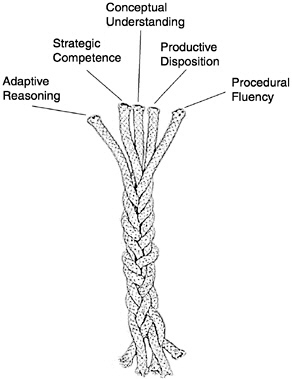

..  Copyright (C)  Jeffrey Elkner, Peter Wentworth, Allen B. Downey, Chris
    Meyers, and Dario Mitchell.  Permission is granted to copy, distribute
    and/or modify this document under the terms of the GNU Free Documentation
    License, Version 1.3 or any later version published by the Free Software
    Foundation; with Invariant Sections being Forward, Prefaces, and
    Contributor List, no Front-Cover Texts, and no Back-Cover Texts.  A copy of
    the license is included in the section entitled "GNU Free Documentation
    License".

The Five Strands of Proficiency
-------------------------------

This was an important study commissioned by the President in the USA. It
looked at what was needed for students to become proficient in maths.  

But it is also an amazingly accurate fit for what we need for proficiency
in Computer Science, or even for proficiency in playing Jazz! 

#. **Procedural Fluency:**  Learn the syntax.  Learn to type.  Learn your way around your tools.
   Learn and practice your scales.  Learn to rearrange formulae.
#. **Conceptual Understanding:**  Understand why the bits fit together like they do.   
#. **Strategic Competence:**  Can you see what to do next?  
   Can you formulate this word problem into your
   notation?  Can you take the music where you want it to go?
#. **Adaptive Reasoning:** Can you see how to change what you've learnt for this new problem?
#. A **Productive Disposition:**  We need that *Can Do!* attitude! 
    a. You habitually think it is worthwhile studying this stuff.
    b. You are diligent and disciplined enough to grind through the tough stuff, 
       and to put in your practice hours.
    c. You develop a sense of *efficacy* --- that you can make things happen!
    
    
