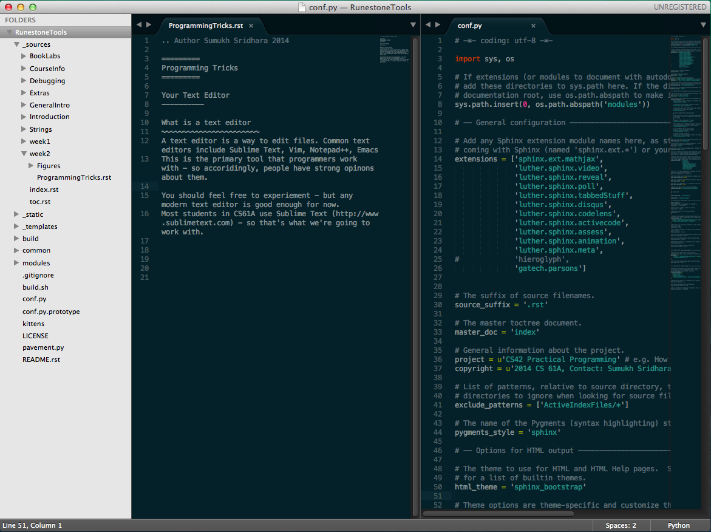
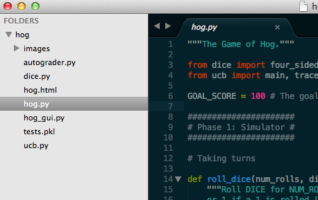

.. Author Sumukh Sridhara 2014

=========
Programming Tricks
=========

Your Text Editor
----------

What is a text editor
~~~~~~~~~~~~~~~~~~~~~~~
A text editor is a way to edit files. 
This is the primary tool that programmers work with - so often people have strong opinons about them. 

You should feel free to experiement with a variety of editors - but any modern text editor is good enough for now. 
Most students in CS61A use Sublime Text (http://www.sublimetext.com) - so that's what we're going to work with. 

Examples of text editors 
~~~~~~~~~~~~~~~~~~~~~~~~~
Common text editors include Sublime Text, Vim, Notepad++, Emacs

You might hear about Vim from other programmers - it's simply a command line based editor (runs in the terminal) that takes advantage of modes (insert vs. scroll) and keyboard shortcuts. It has a high learning curve so we're not going to cover it in this class. 

Bad text editors (Avoid these!): Notepad.exe, TextEdit (on mac), Microsoft Word, IDLE, Python Interactive Mode. 

Sublime Text
--------------

Multiple Selection
~~~~~~~~~~~~~~~~~~~

.. image:: http://i.imgur.com/62RS0C8.gif

Plugins
~~~~~~~~
You can install plugins to make things easier. 

Sidebar
~~~~~~~~
View all the files in the directory so you can switch easily! 

Drag & Drop
~~~~~~~~~~~
You can drag and drop folders/files into sublime text 

Commands
~~~~~~~~~~~
Using the keyboard is faster than using the mouse or scrolling. Trying to find that function? Why scroll through when Sublime will find it for you. 

Press Command/Control - P to open up the window and type '@' followed by your function name. Sublime will automatically take you there. 

.. image:: Figures/atsearch.png 

You can also search for different files in the same folder with the same command - just press Command/Control - P and the name of hte file 

Use the find command for more. Command/Control-F.

Terminal 
----------
The terminal is an interface to work with your computer. Many years ago, the terminal was the only way to interact with a computer. Eventually, computers became powerful enough to support a display and the idea of a desktop and visual interface become possible. You might traditionally use your mouse to navigate around your files or to launch an application, but you can do all of that through the terminal. It's your text-based interface to your computer.

============  ====== 
   Task       Command   
============  ======  
Open Folder      cd 
------------  ------ 
List files       ls 
------------  ------ 
Run python    python 
============  ======

Tricks
~~~~~~~
* The terminal remembers your history - so if you want to rerun a command, just press the up arrow. If you want to see your entire history, run the 'history' command. 

* Need to change someting near the beginning of the line? Don't delete the entire line, just press Control+A to move your cursor the beginning of the line. Now want to move back to the end of the line? Control-E

* You can use the up/down keys or Control-P to search your recent commands. Use Control+R to search for a command and rerun it. 

* To exit from a program, you can use Control+C and to force quit a session Control+D.

* Use Control + and Control - to control the size of the window.

* You can have tabs! Control/Command - T

SSH 
----------
SSH stands for secure shell. It's a way to connect to another computer. With SSH you have a direct interface to the remote computer and your terminal is now a terminal to the remote computer. Any programs you run will be on the remote computer, not yours. The files you see when you are connected are the files on the remote computer, not yours. 

Once you leave SSH you will be back to your own computer.

* Why is SSH not as fast as using my own computer? That's because it needs to send every keystroke to the remote computer and wait for a response, once it gets a response - it will display the output.

* You can use all of the terminal tricks from above while you are in a SSH session. 

Workflow
----------
A common setup is to have your terminal next to your text editor so you can type into your editor and then run commands in your terminal. 

.. image::  http://inst.eecs.berkeley.edu/~cs61a/su14/lab/lab00/assets/productive_workflow.png

How do I get those colors?
~~~~~~~~~~~~~~~~~~~~~~~~~~~~
The theme is called Solarized Dark. (http://ethanschoonover.com/solarized)

OSX Terminal: https://github.com/tomislav/osx-terminal.app-colors-solarized
Sublime Text: https://github.com/SublimeColors/Solarized (Follow the instructions)

Python
--------
Interactive Mode: 
	$ python3 -i 

	Python 3.4.1 (default, May 19 2014, 13:10:29) 
	[GCC 4.2.1 Compatible Apple LLVM 5.1 (clang-503.0.40)] on darwin
	Type "help", "copyright", "credits" or "license" for more information.

	>>> print("hello world")
	hello world

Python program: 
	$ python3 file.py

	hello world

